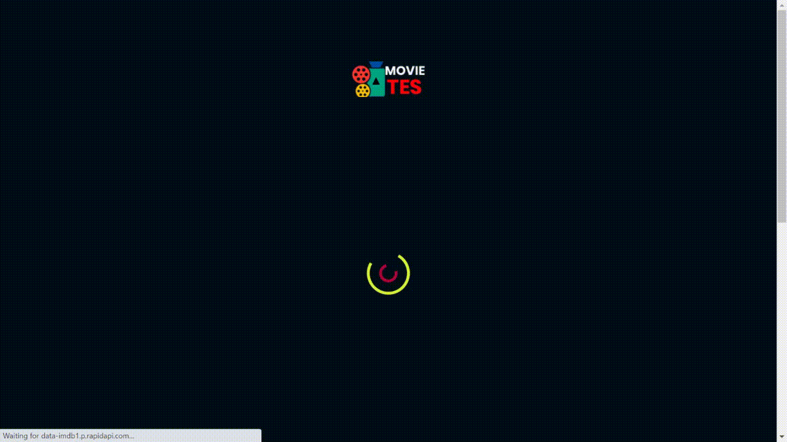
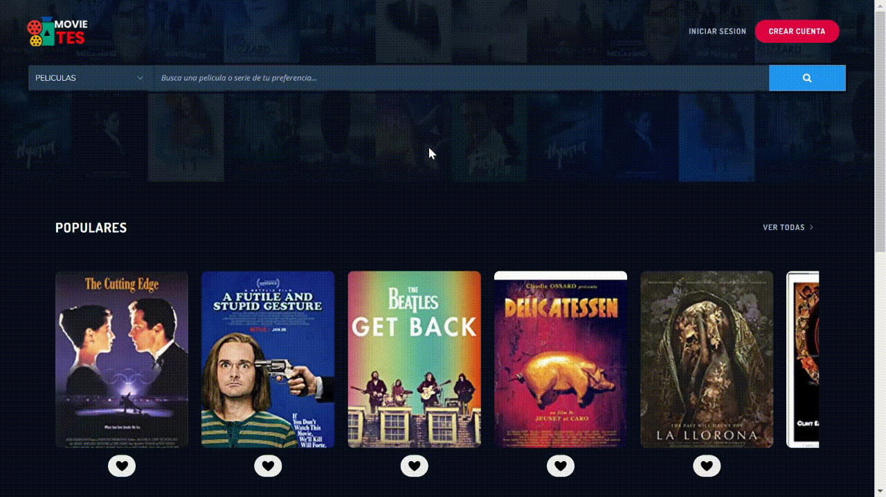
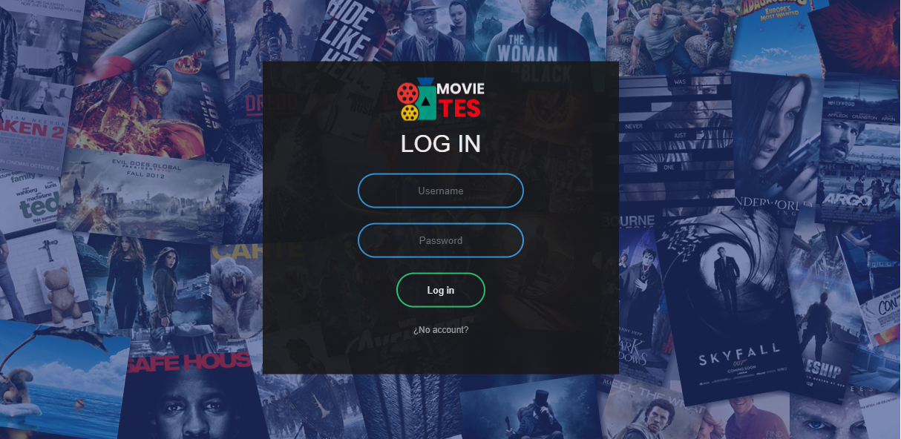
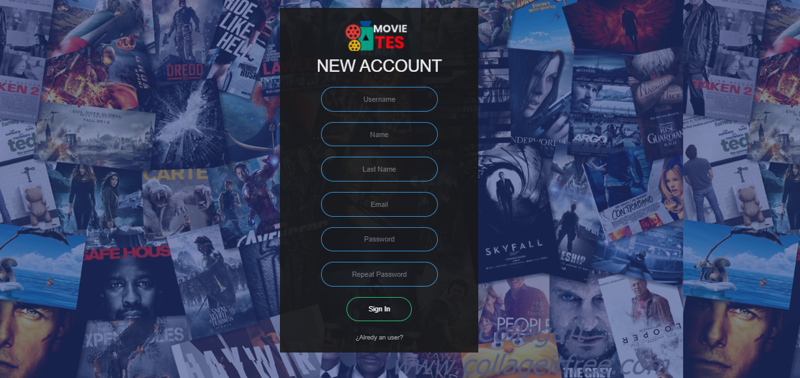
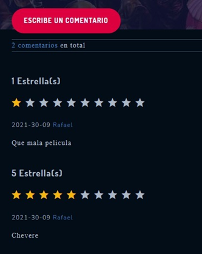
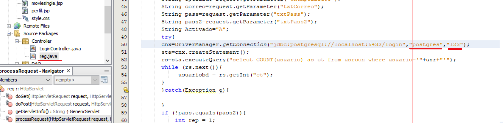

  

# Movie Catalog - Java (JSP) + PostgreSQL

> In this project you will be able to search for movies and see individual information about your favorite ones, create comments, give ratings, create a personal account and much more!

> Pair-Programming was a big part of this project, from the setup to the development. Cheers to all my partners!

## Built With

- Java
- JSP
- PostgreSQL
- PGAdmin 4
- [IMBD-DATA clone API](https://rapidapi.com/SAdrian/api/data-imdb1/)
- HTML + CSS + JavaScript

## Getting Started

**This is an example of how you may give instructions on setting up your project locally.**
**Modify this file to match your project, remove sections that don't apply. For example: delete the testing section if the currect project doesn't require testing.**

To get a local copy up and running follow these simple example steps.

### Prerequisites

- Install [JAVA](https://java.com/en/)
- Install [PostgreSQL](https://www.postgresql.org/) V13 or Higher
- Install [PG Admin 4](https://www.pgadmin.org/download/) to manage posgreSQL faster
- Install [Netbeans 8.2 or higher](https://netbeans.apache.org/download/index.html)
- Install GlassFish Server inside Netbeans.

### FrontEnd Setup

- Download the [Files in the FrontEnd Folder](./FrontEnd)
- Create a folder and paste the files inside.
- In Netbeans, **Open a new project**
- Inside the **WEB-INF** folder you will see the index.jsp file.
- Run the **index.jsp file**

### BackEnd Setup

- Open the PG admin 4 and create a new Database called **login** (You can change this if you want, but in the project you will need to change it too)
- Once the DB is create right click -> Restore the file located in the [BackendEnd Folder](./BackEnd)
- Make sure the database is running. 

### Connection FrontEnd and Backend Setup

- There is a lot of queries to connect the front with the backend, in each query the database name should be the same as the one you created in PG admin 4.
- There is also a field next to the DB set as "123", here you should type your database password. 
- Make sure all of the connection queries are propertly setup, JUST CHANGE THE CONECTION NOT THE QUERIES. 

### Run

- The **Index.jsp** File is the starting point of the project. Make sure you run this file for the full experience. 

## Authors

👤 **Rafael Echart**

- GitHub: [@rafaelechart](https://github.com/rafaelechart)
- Twitter: [@rafaechart](https://twitter.com/rafaechart)

👤 **Jose Garcia**

- GitHub: [@Soreons](https://github.com/Soreons)

## 🤝 Contributing

Contributions, issues, and feature requests are welcome!

Feel free to check the [issues page](../../issues/).

## Show your support

Give a ⭐️ if you like this project!

## Acknowledgments

- TES university
- Rafael Echart
- Jose Garcia

## 📝 License

This project is [MIT](./MIT.md) licensed.
